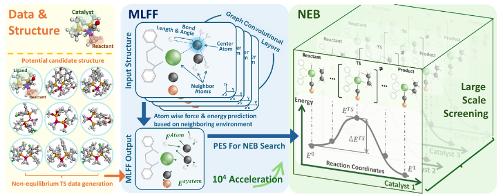

# TSFF
## Introduction
This repository implements machine learning force field method on transition state search. We use this method to efficiently search the transition state in catalysis reaction. Based on this method, we have achieved end-to-end automatic catalyst screening, which can be widely applied to homogeneous catalysis systems and provides significant assistance for high-throughput catalyst screening.


## Code Structure

```
.
├── assets
|   ├── Screening.png
│   └── TSFF_framework.png
├── checkpoints
│   └── placeholder.txt
├── configs
│   ├── neb_config
│   └── training_configs
├── data
│   ├── cata_data
│   ├── gen_cata_data
│   └── t1x_data
├── data_processing
│   ├── dataloader.py
│   ├── reaction_data_creation.py
│   ├── transition1x_data_creation_opt_neb.py
│   └── transition1x_data_creation.py
├── evaluating
│   ├── evaluate_direct.py
│   ├── evaluate_gen.py
│   └── evaluate.py
├── experiment_logs
│   └── rmsd_t1x_neb.log
├── final_checkpoints
│   ├── cata_ckpt
│   ├── gen_cata_ckpt
│   └── t1x_ckpt
├── logs
├── ocpmodels
│   ├── common
│   ├── datasets
│   ├── __init__.py
│   ├── models
│   ├── modules
│   ├── preprocessing
│   ├── __pycache__
│   ├── tasks
│   └── trainers
├── README.md
├── results
├── save
│   ├── cata_neb
│   └── t1x_neb
├── scripts
│   ├── evaluate_cata.sh
│   ├── evaluate_t1x.sh
│   ├── run_diff_arch_t1x.sh
│   ├── run_screening.sh
│   ├── training_cata.sh
│   ├── training_gen_cata.sh
│   ├── training_t1x.sh
│   ├── ts_search_cata.sh
│   └── ts_search_t1x.sh
├── searching
│   ├── interpolate_gen.py
│   ├── interpolate.py
│   ├── neb_direct.py
│   ├── neb_predictor.py
│   └── ts_search.py
└── training
    └── main.py
```

## Download all dataset
You can download the Transition1x dataset from [here](), unzip and put the data folder in a directory structure similar to the previous code.

```
wget 
unzip data.zip
```
## Experiment

### 1. Transition State Search on Transition1x Dataset

#### Training
We use the `scripts/training_t1x.sh` script to train the model.
```bash
bash scripts/training_t1x.sh
```

#### Transition State Search
We use the `scripts/ts_search_t1x.sh` script to search the transition state.
```bash
bash scripts/ts_search_t1x.sh
```


