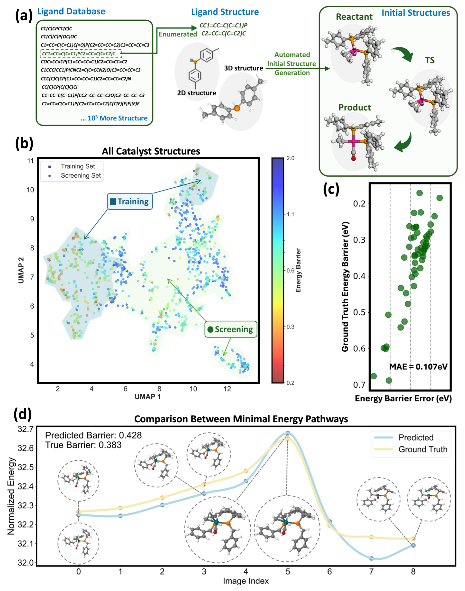

# TSFF
## Introduction
This repository implements machine learning force field method on transition state search. We use this method to efficiently search the transition state in catalysis reaction. Based on this method, we have achieved end-to-end automatic catalyst screening, which can be widely applied to homogeneous catalysis systems and provides significant assistance for high-throughput catalyst screening.


## Code Structure
### Overall Structure
```
.
├── assets
|   ├── Screening.png
│   └── TSFF_framework.png
├── checkpoints
│   └── placeholder.txt
├── configs
│   ├── neb_config
│   └── training_configs
├── data
│   ├── cata_data
│   ├── gen_cata_data
│   └── t1x_data
├── data_processing
│   ├── dataloader.py
│   ├── reaction_data_creation.py
│   ├── transition1x_data_creation_opt_neb.py
│   └── transition1x_data_creation.py
├── evaluating
│   ├── evaluate_direct.py
│   ├── evaluate_gen.py
│   └── evaluate.py
├── experiment_logs
│   └── rmsd_t1x_neb.log
├── final_checkpoints
│   ├── cata_ckpt
│   ├── gen_cata_ckpt
│   └── t1x_ckpt
├── logs
├── ocpmodels
│   ├── common
│   ├── datasets
│   ├── __init__.py
│   ├── models
│   ├── modules
│   ├── preprocessing
│   ├── __pycache__
│   ├── tasks
│   └── trainers
├── README.md
├── results
├── save
│   ├── cata_neb
│   └── t1x_neb
├── scripts
│   ├── evaluate_cata.sh
│   ├── evaluate_t1x.sh
│   ├── run_diff_arch_t1x.sh
│   ├── run_screening.sh
│   ├── training_cata.sh
│   ├── training_gen_cata.sh
│   ├── training_t1x.sh
│   ├── ts_search_cata.sh
│   └── ts_search_t1x.sh
├── searching
│   ├── interpolate_gen.py
│   ├── interpolate.py
│   ├── neb_direct.py
│   ├── neb_predictor.py
│   └── ts_search.py
└── training
    └── main.py
```
### Data Folder Structure
```
.
├── cata_data
│   ├── new_test_fold1.h5
│   ├── new_train_fold1.h5
│   ├── reaction
│   │   ├── reaction.lmdb
│   │   └── reaction.lmdb-lock
│   ├── test
│   │   ├── Rh.lmdb
│   │   └── Rh.lmdb-lock
│   └── train
│       ├── Rh.lmdb
│       └── Rh.lmdb-lock
├── gen_cata_data
│   ├── all_gen_opt_test.h5
│   ├── all_gen_opt_train.h5
│   ├── final_gen
│   │   ├── barriers.csv
│   │   ├── Cat1174
│   │   ├── Cat1176
│   │   ├── Cat1306
│   │   ├── Cat1355
│   │   ├── Cat1402
│   │   ├── Cat1440
│   │   ├── Cat1452
│   │   ├── Cat1460
│   │   ├── Cat1476
│   │   ├── Cat1494
│   │   ├── Cat1496
│   │   ├── Cat1594
│   │   ├── Cat1643
│   │   ├── Cat1821
│   │   ├── Cat1868
│   │   ├── Cat2097
│   │   ├── Cat2128
│   │   ├── Cat2174
│   │   ├── Cat2189
│   │   ├── Cat229
│   │   ├── Cat2303
│   │   ├── Cat2347
│   │   ├── Cat2380
│   │   ├── Cat2391
│   │   ├── Cat2459
│   │   ├── Cat246
│   │   ├── Cat2507
│   │   ├── Cat2574
│   │   ├── Cat2621
│   │   ├── Cat2666
│   │   ├── Cat275
│   │   ├── Cat2766
│   │   ├── Cat2834
│   │   ├── Cat2908
│   │   ├── Cat292
│   │   ├── Cat326
│   │   ├── Cat353
│   │   ├── Cat51
│   │   ├── Cat520
│   │   ├── Cat529
│   │   ├── Cat548
│   │   ├── Cat628
│   │   ├── Cat632
│   │   ├── Cat682
│   │   ├── Cat715
│   │   ├── Cat788
│   │   ├── Cat805
│   │   ├── Cat814
│   │   ├── Cat872
│   │   ├── Cat887
│   │   └── read_db.py
│   ├── new_test_fold1.h5
│   ├── new_train_fold1.h5
│   ├── reaction
│   │   ├── all
│   │   ├── gt_barrier_50.csv
│   │   ├── pred_barrier_50.csv
│   │   └── sort_barrier_all.csv
│   ├── test
│   │   ├── Rh.lmdb
│   │   └── Rh.lmdb-lock
│   └── train
│       ├── Rh.lmdb
│       └── Rh.lmdb-lock
└── t1x_data
    ├── reaction
    │   ├── reaction.lmdb
    │   └── reaction.lmdb-lock
    ├── test
    │   ├── transition1x.lmdb
    │   └── transition1x.lmdb-lock
    ├── train
    │   ├── transition1x.lmdb
    │   └── transition1x.lmdb-lock
    └── val
        ├── transition1x.lmdb
        └── transition1x.lmdb-lock
```


## Download all required files
### Download Dataset
You can download the Transition1x dataset from [here](), unzip and put the data folder in a directory structure similar to the previous code.

### Download Model
You can download the model from [here](), unzip and put the model folder in a directory structure similar to the previous code.

```
unzip data.zip
unzip final_checkpoints.zip
```
## Experiment

### 1. Transition State Search on Transition1x Dataset

#### Training
We use the `scripts/training_t1x.sh` script to train the model.
```bash
bash scripts/training_t1x.sh
```

#### Transition State Search
We use the `scripts/ts_search_t1x.sh` script to search the transition state.
```bash
bash scripts/ts_search_t1x.sh
```

#### Evaluate
We use the `scripts/evaluate_t1x.sh` script to evaluate the transition state search.
```bash
bash scripts/evaluate_t1x.sh
```

### 2. Transition State Search on Rh Catalysis Dataset

#### Training
We use the `scripts/training_cata.sh` script to train the model.
```bash
bash scripts/training_cata.sh
```

#### Transition State Search
We use the `scripts/ts_search_cata.sh` script to search the transition state.
```bash
bash scripts/ts_search_cata.sh
```

#### Evaluate
We use the `scripts/evaluate_cata.sh` script to evaluate the transition state search.
```bash
bash scripts/evaluate_cata.sh
```

### 3. Screening on generated catalysts

Our overall framework is shown in the following figure:

In the `data/gen_cata_data/reaction` folder, catalyst 3d structure with `ComplexGen` generated directly from the ligand is present.
#### Training
We use the `scripts/training_gen.sh` script to train the model.
```bash
bash scripts/training_gen.sh
```

#### Transition State Search
We use the `scripts/ts_search_gen.sh` script to search the transition state.
```bash
bash scripts/ts_search_gen.sh
```

#### Evaluate
We use the `scripts/evaluate_gen.sh` script to evaluate the transition state search.
```bash
bash scripts/evaluate_gen.sh
```

